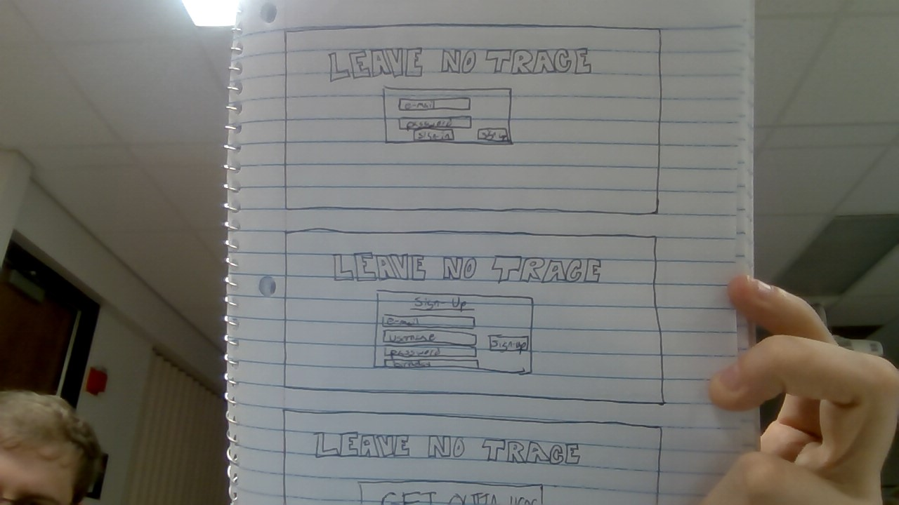
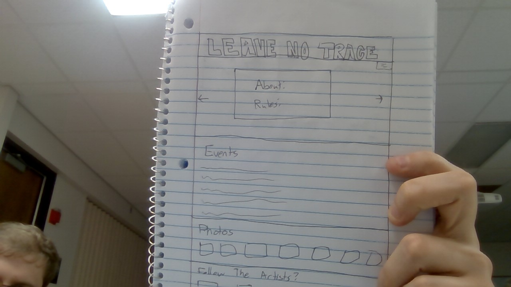
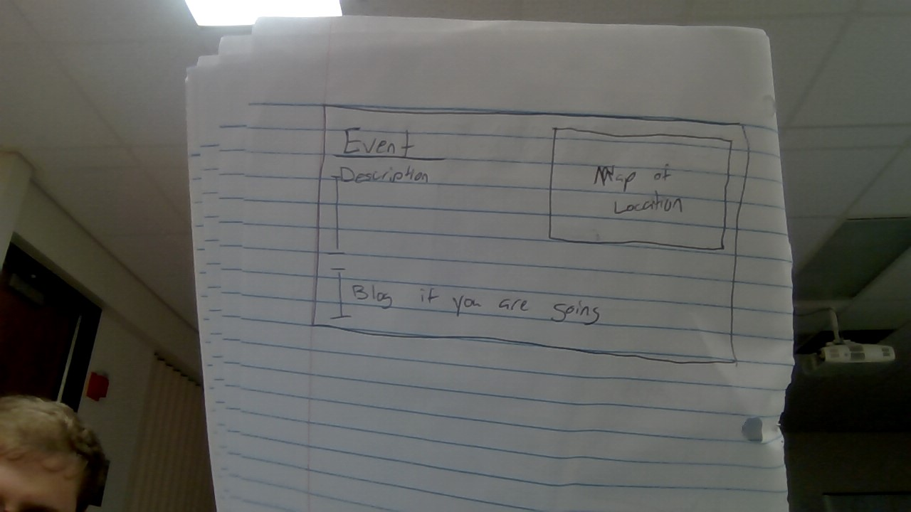
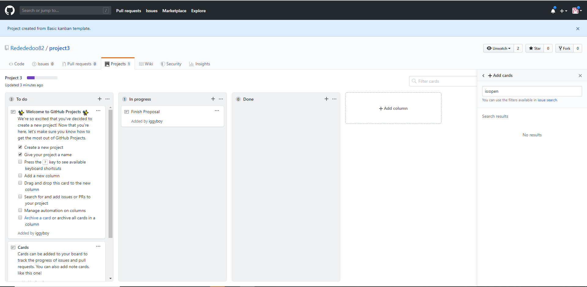

# Overview

### Leave No Trace is a web application that addresses logistical and attendence issues when trying to plan a party after a music event has ended.  It provides a web-based community that people can join to interact and plan with other people, to make the afterparty happen.

# U.I. layouts

# Group member roles

### Aaron
##### Front-end
###### U.I. React dynamic html

### Jack
##### Front-end
###### CSS styling, client side Java Script

### Will
##### Back-end
###### Server Routing, Database, API

### Project Management tool

# New Tech

### Map box

### User Authentication